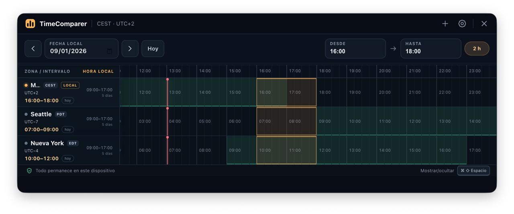

# TimeComparer

TimeComparer es una aplicación de escritorio privada para coordinar horarios entre zonas. En lugar de enseñar una colección de relojes independientes, alinea todas las ciudades sobre una única línea temporal: cada columna es exactamente el mismo instante.



## Qué incluye

- Atajo global configurable (`Ctrl/⌘ + Shift + Espacio` por defecto).
- Detección automática de la zona horaria del sistema en Windows, macOS y Linux.
- Catálogo local de zonas IANA con Seattle, Nueva York, Londres, India, Singapur y más de 400 zonas compatibles.
- Selección visual de un intervalo común, inicialmente de 16:00 a 18:00.
- Indicadores claros de día anterior, mismo día y día siguiente.
- Abreviaturas dinámicas (`CEST/CET`, `PDT/PST`, `EDT/EST`, `BST/GMT`, `IST`, `SGT`, `UTC`) según la fecha seleccionada.
- Horarios laborales independientes por zona, incluidos turnos que cruzan medianoche.
- Conversión automática de DST mediante la base IANA incluida en Electron; no se almacenan offsets como `UTC-8`.
- Ventana compacta, siempre encima, que se oculta con `Esc` o repitiendo el atajo.
- Configuración JSON local, sin cuentas, telemetría, fuentes remotas ni tráfico de red.

## Ejecutar en desarrollo

Requisitos: Node.js 22.12 o superior y npm.

```bash
npm install
npm start
```

Para abrir también las herramientas de desarrollo:

```bash
npm run dev
```

La ventana se cierra visualmente con `Esc` o con la ×, pero el proceso permanece activo para responder al atajo global. Usa **Ajustes → Salir de TimeComparer** para terminarlo por completo.

## Pruebas

```bash
npm test
```

Las pruebas cubren proyección de instantes, saltos y repeticiones por DST, medias horas, cambios de día, turnos nocturnos, validación de preferencias y aislamiento del renderer.

## Crear instaladores

Genera el formato nativo de la plataforma actual:

```bash
npm run dist
```

También existen `dist:win`, `dist:mac` y `dist:linux`. Para una publicación real, construye cada plataforma en su propio runner: macOS necesita macOS para firma y notarización. Los artefactos aparecen en `release/`.

## Datos y privacidad

Las preferencias se guardan en `settings.json` dentro de la carpeta `userData` administrada por Electron:

- Windows: `%APPDATA%\TimeComparer`
- macOS: `~/Library/Application Support/TimeComparer`
- Linux: `$XDG_CONFIG_HOME/TimeComparer` o `~/.config/TimeComparer`

El renderer tiene `nodeIntegration` desactivado, aislamiento de contexto y sandbox. La política CSP usa `connect-src 'none'`, la sesión cancela HTTP/HTTPS/WebSocket y cualquier navegación o ventana nueva se bloquea.

## Cómo se trata el tiempo

El eje horizontal contiene instantes reales (`epoch`); después cada fila los proyecta a su identificador IANA. Esto permite que una misma selección atraviese correctamente:

- días de 23 o 25 horas en la zona local;
- horas inexistentes cuando empieza el DST;
- horas duplicadas cuando termina el DST;
- zonas con media hora o 45 minutos;
- el límite de medianoche en cualquier ciudad.

La base de reglas horarias llega incluida en Electron. Como la app es completamente offline, cambios legislativos futuros se incorporan al actualizar Electron/TimeComparer, no mediante consultas en segundo plano.

## Compatibilidad por sistema

- **Windows 10/11:** atajo global y `always-on-top`; se pueden producir paquetes x64 y ARM64.
- **macOS 12+:** atajo global, Spaces y ventana flotante; una distribución pública necesita firma y notarización.
- **Linux/X11:** comportamiento equivalente, sujeto a las reglas del gestor de ventanas.
- **Linux/Wayland:** Electron usa el portal `org.freedesktop.portal.GlobalShortcuts` y el escritorio puede pedir consentimiento. Wayland no permite a Electron imponer `always-on-top`; TimeComparer detecta este modo y muestra un aviso. La paridad absoluta requeriría integración específica con `xdg-layer-shell` o ejecutar sobre X11/XWayland.

## Estructura

```text
electron/             proceso principal, ventana, atajo, IPC y persistencia
src/                  renderer, estilos, catálogo y motor temporal puro
test/                 pruebas unitarias y de seguridad
.github/workflows/    builds nativos en CI para los tres sistemas
```

La aplicación no usa módulos nativos de Node, lo que simplifica los paquetes x64/ARM64 y reduce diferencias entre sistemas.
